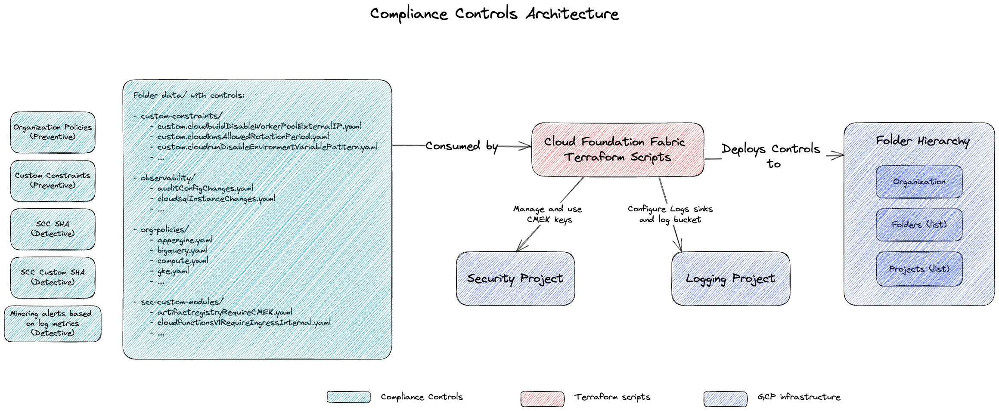

# Compliance Controls

This folder contains a set of compliance controls that can be applied to your Google Cloud environment. It includes preventive controls (custom constraints and organization policies) and detective controls (SCC custom modules and observability).

The diagram below shows the relationships between the components.



## Prerequisites

- A Google Cloud organization.
- A billing account.
- The following APIs enabled in the billing project:
  - `cloudresourcemanager.googleapis.com`
  - `billingbudgets.googleapis.com`
  - `cloudbilling.googleapis.com`
  - `iam.googleapis.com`
  - `serviceusage.googleapis.com`
  - `securitycenter.googleapis.com`
  - `logging.googleapis.com`
  - `monitoring.googleapis.com`
  - `pubsub.googleapis.com`
  - `cloudkms.googleapis.com`

## Variable configuration

The following variables need to be configured in a `.tfvars` file:

```tfvars
organization = {
  id          = "123456789012"
  domain      = "example.com"
  customer_id = "C01234567"
}

billing_project = "your-billing-project-id"
location        = "your-location"
billing_account = "your-billing-account-id"

target_organization = true

security_project = {
  parent = "folders/123456789012"
  name   = "your-security-project-id"
}

logging_project = {
  parent = "folders/123456789012"
  name   = "your-logging-project-id"
}
```

## Variables

| Name | Description | Type | Default | Required |
|------|-------------|------|---------|:--------:|
| `billing_account` | The billing account. | `string` | n/a | yes |
| `billing_project` | The billing project ID. | `string` | n/a | yes |
| `location` | The location. | `string` | n/a | yes |
| `log_sinks` | Org-level log sinks, in name => {type, filter} format. | `<pre>map(object({<br>    filter     = string<br>    disabled   = optional(bool, false)<br>    exclusions = optional(map(string), {})<br>  }))</pre>` | `{ audit-logs = { filter = <<-FILTER log_id("cloudaudit.googleapis.com/activity") OR log_id("cloudaudit.googleapis.com/system_event") OR log_id("cloudaudit.googleapis.com/policy") OR log_id("cloudaudit.googleapis.com/access_transparency") FILTER exclusions = { gke-audit = "protoPayload.serviceName="k8s.io"" } } }` | no |
| `logging_project` | The logging project ID where to create log metrics and alerts. | `<pre>object({<br>    parent        = string<br>    name          = string<br>    number        = optional(number)<br>    project_reuse = optional(bool, false)<br>  })</pre>` | n/a | yes |
| `organization` | Organization details. | `<pre>object({<br>    id          = number<br>    domain      = optional(string)<br>    customer_id = optional(string)<br>  })</pre>` | n/a | yes |
| `security_project` | The security project ID where to manage encryption keys. | `<pre>object({<br>    parent        = string<br>    name          = string<br>    number        = optional(number)<br>    project_reuse = optional(bool, false)<br>  })</pre>` | n/a | yes |
| `target_folders` | A list of folder IDs to apply controls to. | `list(string)` | `[]` | no |
| `target_organization` | Set to true to apply controls at the organization level. | `bool` | `false` | no |
| `target_projects` | A list of project IDs to apply controls to. | `<pre>list(object({<br>    name   = string<br>    number = number<br>  }))</pre>` | `[]` | no |

## Outputs

| Name | Description |
|------|-------------|
| `kms_key` | KMS key created |
| `logging_project_id` | Logging project id |
| `notification_channel` | Notification channel created |
| `pubsub_topic` | Pub/Sub topic for monitoring alerts |
| `security_project_id` | Security project id |

## Tests

You can test the compliance controls by running `terraform plan` and `terraform apply`. This will show you the changes that will be made to your environment and allow you to confirm that they are correct.

## Controls

### Preventive Controls

#### Organization Policies
| Policy | Description | CIS Benchmark for GCP 3.0 | CIS Benchmarks for GKE 1.5 | PCI-DSS 4.0 |
|---|---| :---: | :---: | :---: |
| `appengine.disableCodeDownload` | Disables code download from App Engine. |  |  |  |
| `bigquery.disableBQOmniAWS` | Disables BigQuery Omni for AWS. |  |  |  |
| `bigquery.disableBQOmniAzure` | Disables BigQuery Omni for Azure. |  |  |  |
| `cloudbuild.disableCreateDefaultServiceAccount` | Disables the creation of the default service account for Cloud Build. |  |  |  |
| `cloudbuild.allowedIntegrations` | Denies all integrations. |  |  |  |
| `cloudbuild.allowedWorkerPools` | Allows worker pools under the organization. |  |  |  |
| `cloudfunctions.allowedIngressSettings` | Allows only internal ingress for Cloud Functions. |  |  |  |
| `cloudfunctions.requireVPCConnector` | Requires a VPC connector for Cloud Functions. |  |  |  |
| `cloudfunctions.allowedVpcConnectorEgressSettings` | Allows all egress traffic from the VPC connector. |  |  |  |
| `gcp.restrictNonCmekServices` | Restricts services that do not support CMEK. | 7.2 |  | 3.1.1, 3.3.2, 3.3.3, 3.5.1, 3.5.1.2, 3.5.1.3, 8.3.2 |
| `gcp.restrictCmekCryptoKeyProjects` | Restricts the projects that can be used for CMEK crypto keys. |  |  |  |
| `run.allowedBinaryAuthorizationPolicies` | Allows the default Binary Authorization policy. |  |  |  |
| `run.allowedIngress` | Allows only internal ingress for Cloud Run. |  |  |  |
| `run.allowedVPCEgress` | Allows all egress traffic from the VPC. |  |  |  |
| `run.managed.requireInvokerIam` | Requires invoker IAM role for Cloud Run services. |  |  |  |
| `sql.restrictAuthorizedNetworks` | Restricts authorized networks for Cloud SQL. |  |  |  |
| `sql.restrictPublicIp` | Restricts public IP for Cloud SQL. | 6.6 |  | 1.3.1 |
| `compute.managed.disableNestedVirtualization` | Disables nested virtualization. |  |  |  |
| `compute.restrictCloudNATUsage` | Restricts Cloud NAT usage to a specific project. |  |  |  |
| `compute.managed.vmCanIpForward` | Allows IP forwarding for VMs. | 4.6 |  |  |
| `compute.restrictNonConfidentialComputing` | Restricts non-confidential computing services. | 4.11 |  | 3.1.1<br>3.3.2<br>3.3.3<br>3.5.1<br>3.5.1.2<br>3.5.1.3<br>8.3.2 |
| `compute.managed.disableGuestAttributesAccess` | Disables guest attributes access. |  |  |  |
| `compute.skipDefaultNetworkCreation` | Skips the creation of the default network. |  |  |  |
| `gcp.restrictTLSCipherSuites` | Restricts TLS cipher suites to NIST recommended ciphers. | 3.9 |  |  |
| `gcp.restrictTLSVersion` | Restricts TLS versions 1.0 and 1.1. | 3.9 |  |  |
| `compute.requireSslPolicy` | Requires an SSL policy. | 3.9 |  |  |
| `iam.automaticIamGrantsForDefaultServiceAccounts` | Disables automatic IAM grants for default service accounts. | 4.1 |  | 2.2.2<br>2.3.1 |
| `compute.requireOsLogin` | Requires OS Login. | 4.4 |  | 1.2.5,<br>2.2.4<br>6.4.1 |
| `compute.managed.disableSerialPortAccess` | Disables serial port access. | 4.5 |  | 1.2.1, 1.4.1 |
| `compute.managed.disableSerialPortLogging` | Disables serial port logging. |  |  |  |
| `compute.requireShieldedVm` | Requires Shielded VMs. | 4.8 |  |  |
| `compute.managed.vmExternalIpAccess` | Disables external IP access for VMs. | 4.9 |  | 1.3.1 |
| `compute.managed.blockPreviewFeatures` | Blocks preview features. |  |  |  |
| `compute.trustedImageProjects` | Restricts trusted image projects. |  |  |  |
| `essentialcontacts.managed.allowedContactDomains` | Restricts contact domains to the organization's domain. |  |  |  |
| `container.managed.disableLegacyClientCertificateIssuance` | Disables legacy client certificate issuance. |  | 2.1.1<br>5.8.1 | 4.1 |
| `container.managed.enableBinaryAuthorization` | Enables Binary Authorization for GKE. |  | 5.1.4<br>5.10.3<br>5.10.4 | 6.2.1 |
| `container.managed.disallowDefaultComputeServiceAccount` | Disallows the default compute service account for GKE. |  | 5.2.1 | 2.2.4, 7.2 |
| `container.managed.enableWorkloadIdentityFederation` | Enables Workload Identity Federation for GKE. |  | 5.2.2 | 7.2.2 |
| `container.managed.enableSecretsEncryption` | Enables secrets encryption for GKE. |  | 5.3.1 | 3.6 |
| `container.managed.enableShieldedNodes` | Enables Shielded Nodes for GKE. |  | 5.5.5 |  |
| `container.managed.enablePrivateNodes` | Enables private nodes for GKE. |  | 5.6.5 | 1.3.1 |
| `container.managed.enableNetworkPolicy` | Enables network policy for GKE. |  | 5.6.7 | 1.2,1.1,1.4 |
| `container.managed.enableCloudLogging` | Enables Cloud Logging for GKE. |  | 5.7.1 | 10.2 |
| `container.managed.enableGoogleGroupsRBAC` | Enables Google Groups RBAC for GKE. |  | 5.8.2 | 1.1.2 |
| `container.managed.disableABAC` | Disables ABAC for GKE. |  |  |  |
| `container.managed.disableInsecureKubeletReadOnlyPort` | Disables the insecure Kubelet read-only port. |  |  |  |
| `container.managed.disableRBACSystemBindings` | Disables RBAC system bindings. |  |  |  |
| `container.managed.enableSecurityBulletinNotifications` | Enables security bulletin notifications. |  |  |  |
| `iam.managed.disableServiceAccountKeyCreation` | Disables service account key creation. | 1.4 |  |  |
| `iam.managed.disableServiceAccountKeyUpload` | Disables service account key upload. |  |  |  |
| `iam.managed.disableServiceAccountApiKeyCreation` | Disables service account API key creation. |  |  |  |
| `iam.managed.allowedPolicyMembers` | Restricts policy members to the organization. | 1.1 |  |  |
| `iam.allowedPolicyMemberDomains` | Restricts policy member domains to the organization's customer ID. | 1.1 |  |  |
| `iam.managed.preventPrivilegedBasicRolesForDefaultServiceAccounts` | Prevents privileged basic roles for default service accounts. |  |  |  |
| `iam.disableAuditLoggingExemption` | Disables audit logging exemption. |  |  |  |
| `compute.restrictDedicatedInterconnectUsage` | Restricts dedicated interconnect usage to the organization. |  |  |  |
| `compute.restrictLoadBalancerCreationForTypes` | Restricts load balancer creation to internal load balancers. |  |  |  |
| `compute.restrictPartnerInterconnectUsage` | Restricts partner interconnect usage to the organization. |  |  |  |
| `compute.restrictSharedVpcHostProjects` | Restricts shared VPC host projects to the organization. |  |  |  |
| `compute.restrictVpcPeering` | Restricts VPC peering to the organization. |  |  |  |
| `compute.restrictVpnPeerIPs` | Restricts VPN peer IPs to a specific project. |  |  |  |
| `compute.requireVpcFlowLogs` | Requires VPC flow logs. | 3.8 |  |  |
| `gcp.resourceLocations` | Restricts resource locations to Asia and Singapore. |  |  |  |
| `gcp.restrictServiceUsage` | Restricts service usage to a list of allowed services. |  |  |  |
| `storage.publicAccessPrevention` | Enforces public access prevention for Cloud Storage. | 5.1 |  | 1.3.1 |
| `storage.uniformBucketLevelAccess` | Enforces uniform bucket-level access for Cloud Storage. | 5.2 |  | 1.3.1 |
| `storage.secureHttpTransport` | Enforces secure HTTP transport for Cloud Storage. |  |  |  |
| `storage.restrictAuthTypes` | Restricts HMAC signed requests for Cloud Storage. |  |  |  |
| `ainotebooks.disableFileDownloads` | Disables file downloads from AI Notebooks. |  |  |  |
| `ainotebooks.disableRootAccess` | Disables root access to AI Notebooks. |  |  |  |
| `ainotebooks.restrictPublicIp` | Restricts public IP for AI Notebooks. |  |  |  |
| `ainotebooks.restrictVpcNetworks` | Restricts VPC networks for AI Notebooks to the organization. |  |  |  |

#### Custom Constraints
| Constraint | Description | CIS Benchmark for GCP 3.0 | CIS Benchmarks for GKE 1.5 | PCI-DSS 4.0 |
|---|---| :---: | :---: | :---: |
| `custom.cloudbuildDisableWorkerPoolExternalIP` | Disables external IP for Cloud Build worker pools. |  |  |  |
| `custom.cloudkmsAllowedRotationPeriod` | Enforces a maximum rotation period for Cloud KMS keys. | 1.10 |  | 3.1.1, 3.3.2, 3.3.3, 3.5.1, 3.5.1.2, 3.5.1.3, 8.3.2 |
| `custom.cloudrunDisableEnvironmentVariablePattern` | Disables environment variables that match a certain pattern in Cloud Run. | 1.17 |  |  |
| `custom.cloudrunJobRequireBinaryAuthorization` | Requires Binary Authorization for Cloud Run jobs. |  |  |  |
| `custom.cloudrunServiceRequireBinaryAuthorization` | Requires Binary Authorization for Cloud Run services. |  |  |  |
| `custom.cloudsqlDisablePublicAuthorizedNetworks` | Disables public authorized networks for Cloud SQL. | 6.5 |  | 1.3.1 |
| `custom.cloudsqlEnforcePasswordComplexity` | Enforces password complexity for Cloud SQL. |  |  |  |
| `custom.cloudsqlRequireAutomatedBackup` | Requires automated backups for Cloud SQL. | 6.7 |  |  |
| `custom.cloudsqlRequireMySQLDatabaseFlags` | Requires specific database flags for Cloud SQL for MySQL. | 6.1.2 |  | 1.3.1 |
| `custom.cloudsqlRequirePointInTimeRecovery` | Requires point-in-time recovery for Cloud SQL. |  |  |  |
| `custom.cloudsqlRequirePostgreSQLDatabaseFlags` | Requires specific database flags for Cloud SQL for PostgreSQL. | 6.2.2 |  | 10.2.1, 10.2.1.2, 10.2.1.5, 9.4.5 |
| `custom.cloudsqlRequireRootPassword` | Requires a root password for Cloud SQL. | 6.1.1 |  |  |
| `custom.cloudsqlRequireSQLServerDatabaseFlags` | Requires specific database flags for Cloud SQL for SQL Server. | 6.3.1 |  | 1.2.5, 2.2.4, 6.4.3 |
| `custom.cloudsqlRequireSSLConnection` | Requires SSL connections for Cloud SQL. | 6.4 |  |  |
| `custom.dataprocRequireDiskCmekEncryption` | Requires customer-managed encryption keys (CMEK) for Dataproc disks. | 8.1 |  |  3.1.1, 3.3.2, 3.3.3, 3.5.1, 3.5.1.2, 3.5.1.3, 8.3.2 |
| `custom.dnsAllowedSigningAlgorithms` | Restricts the allowed signing algorithms for DNSSEC. | 3.4 |  | 1.1.1, 1.2.1, 1.2.6, 1.2.7, 1.4.2, 1.5.1, 2.1.1, 2.2.1 |
| `custom.dnsRequireManageZoneDNSSEC` | Requires DNSSEC to be enabled for managed zones. | 3.3 |  | 1.1.1, 1.2.1, 1.2.6, 1.2.7, 1.4.2, 1.5.1, 2.1.1, 2.2.1 |
| `custom.dnsRequirePolicyLogging` | Requires DNS policy logging. | 2.12 |  | 10.4.1, 10.4.1.1, 10.4.2, 10.4.3 |
| `custom.firewallRestrictOpenWorldRule` | Restricts firewall rules that are open to the world. |  |  |  |
| `custom.firewallRestrictRdpPolicyRule` | Restricts RDP access in firewall policy rules. | 3.7 |  | 1.2.1, 1.4.1 |
| `custom.firewallRestrictRdpRule` | Restricts RDP access in firewall rules. | 3.7 |  | 1.2.1, 1.4.1 |
| `custom.firewallRestrictSshPolicyRule` | Restricts SSH access in firewall policy rules. | 3.6 |  | 1.2.1, 1.4.1 |
| `custom.firewallRestrictSshRule` | Restricts SSH access in firewall rules. | 3.6 |  | 1.2.1, 1.4.1 |
| `custom.gkeAllowedInitialClusterVersions` | Restricts the allowed initial cluster versions for GKE. |  |  | 6.3.1 |
| `custom.gkeAllowedNodePoolImages` | Restricts the allowed node pool images for GKE. |  | 5.5.1 | 2.2.6, 5.2, 6.2.1 |
| `custom.gkeAllowedReleaseChannels` | Restricts the allowed release channels for GKE. |  | 5.5.4 |  |
| `custom.gkeDisableAlphaCluster` | Disables alpha clusters in GKE. |  | 5.10.2 |  |
| `custom.gkeDisableKubernetesDashboard` | Disables the Kubernetes dashboard in GKE. |  | 5.10.1 | 6.4 |
| `custom.gkeDisableLegacyAbac` | Disables legacy ABAC in GKE. |  | 5.8.3 | 4.1 |
| `custom.gkeDisableLegacyMetadataEndpoints` | Disables legacy metadata endpoints in GKE. |  | 5.4.1 |  |
| `custom.gkeRequireCOSImage` | Requires Container-Optimized OS (COS) images for GKE nodes. |  |  | 2.2.6 |
| `custom.gkeRequireDataplaneV2` | Requires Dataplane V2 for GKE clusters. |  |  |  |
| `custom.gkeRequireGKEMetadataServer` | Requires the GKE metadata server for GKE clusters. |  | 5.4.2 |  |
| `custom.gkeRequireIntegrityMonitoring` | Requires integrity monitoring for GKE nodes. |  | 5.5.6 |  |
| `custom.gkeRequireIntraNodeVisibility` | Requires intra-node visibility for GKE clusters. |  | 5.6.1 | 10.2 |
| `custom.gkeRequireMasterAuthorizedNetworks` | Requires master authorized networks for GKE clusters. |  | 5.6.3 | 1.2.5 |
| `custom.gkeRequireMonitoring` | Requires monitoring for GKE clusters. |  | 5.7.1 | 10.2 |
| `custom.gkeRequireNodePoolAutoRepair` | Requires auto-repair for GKE node pools. |  | 5.5.2 | 2.2.6 |
| `custom.gkeRequireNodePoolAutoUpgrade` | Requires auto-upgrade for GKE node pools. |  | 5.5.3 | 2.2.6 |
| `custom.gkeRequireNodePoolCMEKEncryption` | Requires customer-managed encryption keys (CMEK) for GKE node pools. |  | 5.9.1 | 3.6 |
| `custom.gkeRequireNodePoolSandbox` | Requires sandboxing for GKE node pools. |  | 5.10.3 | 6.2.1 |
| `custom.gkeRequirePrivateEndpoint` | Requires private endpoints for GKE clusters. |  | 5.6.4 | 1.3.1 |
| `custom.gkeRequireRegionalClusters` | Requires regional clusters for GKE. |  |  |  |
| `custom.gkeRequireSecureBoot` | Requires secure boot for GKE nodes. |  | 5.5.7 |  |
| `custom.gkeRequireVPCNativeCluster` | Requires VPC-native clusters for GKE. |  | 5.6.2 | 1.4.3 |
| `custom.iamAllowedMembers` | Restricts the allowed members for IAM policies. | 1.1 |  |  |
| `custom.iamDisableAdminServiceAccount` | Disables the admin service account. | 1.5 |  |  |
| `custom.iamDisableBasicRoles` | Disables basic IAM roles. |  |  |  |
| `custom.iamDisableProjectServiceAccountImpersonationRoles` | Disables project service account impersonation roles. | 1.6 |  | 1.3.1 |
| `custom.iamDisablePublicBindings` | Disables public bindings for IAM policies. | 7.1 |  | 1.3.1 |
| `custom.networkDisableTargetHTTPProxy` | Disables target HTTP proxies. | 3.9 |  |  |
| `custom.networkDisableWeakSSLPolicy` | Disables weak SSL policies. | 3.9 |  |  |
| `custom.networkRequireBackendServiceLogging` | Requires logging for backend services. | 2.16 |  | 10.2.1, 10.2.1.1, 10.2.1.2, 10.2.1.3, 10.2.1.4, 10.2.1.5, 10.2.1.6, 10.2.1.7, 10.2.2, 5.3.4, 6.4.1, 6.4.2 |
| `custom.networkRequireCustomModeVpc` | Requires custom mode VPCs. | 3.1 | 3.1 | 1.1.1, 1.2.1, 1.2.6, 1.2.7, 1.4.2, 1.5.1, 2.1.1, 2.2.1 |
| `custom.networkRequireSubnetPrivateGoogleAccess` | Requires private Google access for subnets. |  |  |  |

### Detective Controls

#### SCC Custom Modules
| Module | Description | CIS Benchmark for GCP 3.0 | CIS Benchmarks for GKE 1.5 | PCI-DSS 4.0 |
|---|---| :---: | :---: | :---: |
| `artifactregistryRequireCMEK` | Requires customer-managed encryption keys (CMEK) for Artifact Registry. |  |  |  |
| `cloudfunctionsV1RequireIngressInternal` | Requires internal ingress for Cloud Functions V1. |  |  |  |
| `cloudfunctionsV1RequireIngressInternalAndLoadBalancer` | Requires internal ingress and a load balancer for Cloud Functions V1. |  |  |  |
| `cloudfunctionsV1RequireVPCConnector` | Requires a VPC connector for Cloud Functions V1. |  |  |  |
| `cloudkmsAllowedCmekProjects` | Restricts the allowed projects for Cloud KMS CMEK. |  |  |  |
| `cloudrunRequireBinaryAuthorization` | Requires Binary Authorization for Cloud Run. |  |  |  |
| `cloudrunRequireEgressAllTraffic` | Requires all egress traffic for Cloud Run. |  |  |  |
| `cloudrunRequireIngressInternalAndLoadBalancer` | Requires internal ingress and a load balancer for Cloud Run. |  |  |  |
| `cloudsqlRequirePointInTimeRecovery` | Requires point-in-time recovery for Cloud SQL. |  |  |  |
| `computeDisableNestedVirtualization` | Disables nested virtualization for Compute Engine. |  |  |  |
| `gkeDisableClientCertificateAuth` | Disables client certificate authentication for GKE. |  |  |  |
| `gkeRequireDataplaneV2` | Requires Dataplane V2 for GKE clusters. |  |  |  |
| `gkeRequireRegionalCluster` | Requires regional clusters for GKE. |  |  |  |
| `serviceusageAllowedServices` | Restricts the allowed services for Service Usage. |  |  |  |

#### Observability
| Alert | Description | CIS Benchmark for GCP 3.0 | CIS Benchmarks for GKE 1.5 | PCI-DSS 4.0 |
|---|---| :---: | :---: | :---: |
| `auditConfigChanges` | Alerts on changes to audit configurations. | 2.5 |  | 10.2.1, 10.2.1.1, 10.2.1.2, 10.2.1.3, 10.2.1.4, 10.2.1.5, 10.2.1.6, 10.2.1.7, 10.2.2, 5.3.4, 6.4.1, 6.4.2 |
| `cloudsqlInstanceChanges` | Alerts on changes to Cloud SQL instances. | 2.11 |  | 10.2.1, 10.2.1.1, 10.2.1.2, 10.2.1.3, 10.2.1.4, 10.2.1.5, 10.2.1.6, 10.2.1.7, 10.2.2, 5.3.4, 6.4.1, 6.4.2 |
| `customRoleChanges` | Alerts on changes to custom IAM roles. | 2.6 |  | 10.2.1, 10.2.1.1, 10.2.1.2, 10.2.1.3, 10.2.1.4, 10.2.1.5, 10.2.1.6, 10.2.1.7, 10.2.2, 5.3.4, 6.4.1, 6.4.2 |
| `firewallPolicyRuleChanges` | Alerts on changes to firewall policy rules. | 2.7 |  | 10.2.1, 10.2.1.1, 10.2.1.2, 10.2.1.3, 10.2.1.4, 10.2.1.5, 10.2.1.6, 10.2.1.7, 10.2.2, 5.3.4, 6.4.1, 6.4.2 |
| `firewallRuleChanges` | Alerts on changes to firewall rules. | 2.7 |  | 10.2.1, 10.2.1.1, 10.2.1.2, 10.2.1.3, 10.2.1.4, 10.2.1.5, 10.2.1.6, 10.2.1.7, 10.2.2, 5.3.4, 6.4.1, 6.4.2 |
| `networkChanges` | Alerts on changes to networks. | 2.9 |  |  |
| `networkRouteChanges` | Alerts on changes to network routes. | 2.8 |  | 10.2.1, 10.2.1.1, 10.2.1.2, 10.2.1.3, 10.2.1.4, 10.2.1.5, 10.2.1.6, 10.2.1.7, 10.2.2, 5.3.4, 6.4.1, 6.4.2 |
| `projectOwnershipChange` | Alerts on changes to project ownership. | 2.4 |  | 10.2.1, 10.2.1.1, 10.2.1.2, 10.2.1.3, 10.2.1.4, 10.2.1.5, 10.2.1.6, 10.2.1.7, 10.2.2, 5.3.4, 6.4.1, 6.4.2 |
| `storageIamChanges` | Alerts on changes to Cloud Storage IAM policies. | 2.10 |  | 10.2.1, 10.2.1.1, 10.2.1.2, 10.2.1.3, 10.2.1.4, 10.2.1.5, 10.2.1.6, 10.2.1.7, 10.2.2, 5.3.4, 6.4.1, 6.4.2 |
